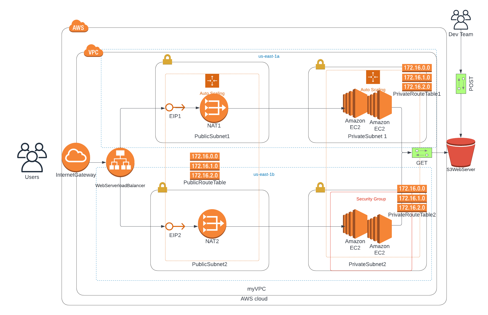

# Udacity Cloud DevOps Udagram Project2

## Deploy a High-Availability Web App using CloudFormation

#### Salaudeen O. Abdulrasaq salaudeen.abdulrasaq2021@gmail.com

# STATEMENT PROBLEM

## Scenario
Your company is creating an Instagram clone called Udagram.

Developers want to deploy a new application to the AWS infrastructure.

You have been tasked with provisioning the required infrastructure and deploying a dummy application, along with the necessary supporting software.

This needs to be automated so that the infrastructure can be discarded as soon as the testing team finishes their tests and gathers their results.

Optional - To add more challenge to the project, once the project is completed, you can try deploying sample website files located in a public S3 Bucket to the Apache Web Server running on an EC2 instance.

# MY SOLUTION:

### Architecture Diagram

# Website Link :

[http://serve-WebSe-15QTPYAIXE924-1193114271.us-east-1.elb.amazonaws.com](http://serve-WebSe-15QTPYAIXE924-1193114271.us-east-1.elb.amazonaws.com)
